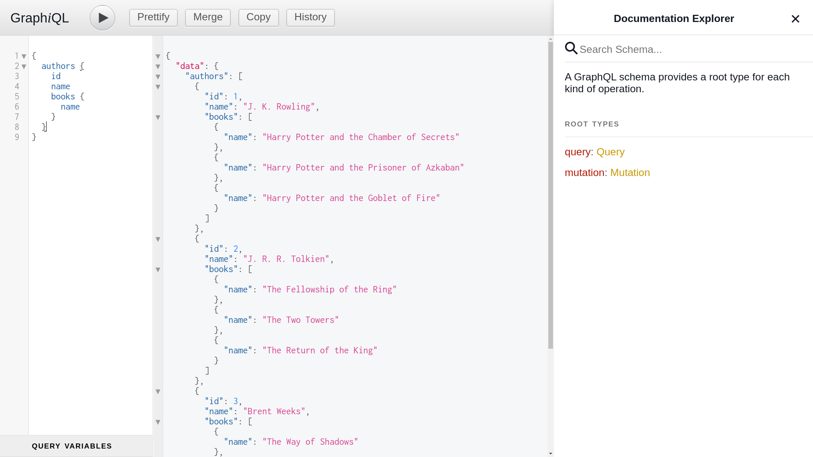

# First NodeJS GraphQL

Good example for starter and learning GraphQL + NodeJS easily and fastly. (Just in 10 minutes)


## Using

```
$ yarn install
$ yarn start
```

Then open: `http://localhost:5000/graphql/?query=%7B%0A%20%20books%20%7B%0A%20%20%20%20id%2C%0A%20%20%20%20name%0A%20%20%7D%0A%0A%7D`

## Examples

#### List of all books id and name
```
{
  books {
    id,
    name
  }
}
```


#### List of authors and their books

```
{
  authors {
    id
    name
    books {
      name
    }
  }
}
```




## Similar Repository

- https://github.com/BaseMax/first-nodejs-apollo-graphql/

### References

- https://graphql.org/graphql-js/running-an-express-graphql-server
- https://github.com/graphql/express-graphql
- https://www.youtube.com/watch?v=n1mdAPFq2Os
- https://www.youtube.com/watch?v=YBydg_Ui02Q
- https://www.youtube.com/watch?v=ZQL7tL2S0oQ

---------

